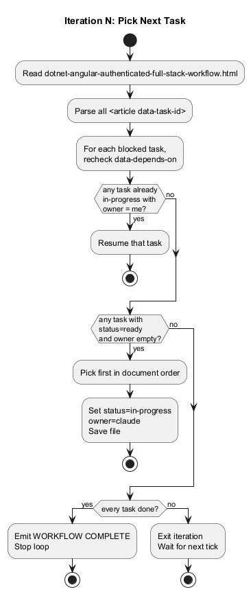
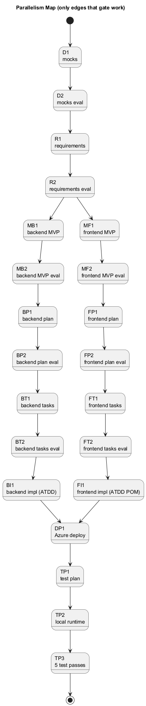
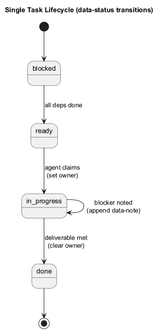
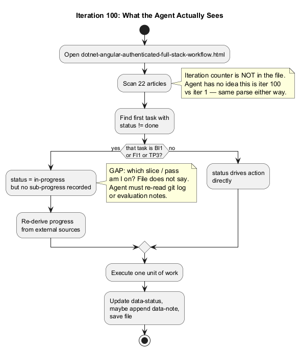

# Workflow Decision Trees

Companion analysis for `C:\projects\claude-create-app\dotnet-angular-authenticated-full-stack-workflow.html`.

## Is the workflow file efficient for an agent?

**Short answer:** the *parsing* is efficient, the *state model* is not. It works fine for iterations 1–20. By iteration 100 the agent is re-deriving progress from sources outside the file (git log, evaluation notes, bug logs) because three tasks — `BI1`, `FI1`, `TP3` — are loops that the file represents as a single article.

### What is good

- **Deterministic parse.** Every task is an `<article>` with `data-task-id`, `data-status`, `data-depends-on`, `data-parallel-group`, `data-skill`, `data-evaluation-passes`. The agent can reach a decision in one DOM scan (~22 elements, ~450 lines).
- **Single source of truth.** Status, ownership, and dependencies live in one file. No drift between a board and the code.
- **Topological ordering already encoded.** Picking "first ready unowned in document order" is a valid schedule because the file is authored in dependency order.
- **Self-describing.** `data-skill` tells the agent which skill to invoke; `data-evaluation-passes` tells it whether the task is an evaluation gate.

### What breaks down at iteration 100

| Gap | Why it hurts at iter 100 | Fix |
|---|---|---|
| No iteration counter in the file | Agent can't tell iter 1 from iter 100. Same parse, no learning. | Add `<section id="state" data-iteration="100" data-current-task="BI1">`. |
| `BI1` / `FI1` / `TP3` are loop containers, not atomic tasks | After 50 iters into `BI1`, the file still says `in-progress`. Which slice is next? Agent must read git log or `./docs/evaluations/`. | Nest child `<article>` slices under `BI1`, each with its own `data-status`. |
| Evaluation-pass progress is invisible | `TP3` requires 5 passes. The file does not record "pass 3 done". | Add `data-passes-completed="3"`. |
| No history of completed iterations | "What did iter 47 do?" only answerable via git log. | Append-only `<section id="iteration-log">` (one `<li>` per iteration). |
| Single `data-owner` per task | Real parallelism (two agents on backend + frontend) cannot coordinate beyond "different tasks". | Acceptable today (one agent per loop tick); revisit only if multiple agents run concurrently. |
| Full file re-read every iteration | Cheap at 450 lines; expensive once children + iteration log exist. | Move iteration log to a sibling file (`iterations.md`) referenced by the state section. |

### Verdict

Keep the article-per-task structure. Add a `state` section at the top and decompose the three loop tasks. Without those two changes, the agent at iter 100 spends most of its tokens reconstructing context that should have been written into the file when iter 99 finished.

---

## Decision tree 1 — Pick the next task

The core per-iteration loop. The agent reads the file, resolves `blocked → ready` for any task whose deps are all `done`, then chooses what to work on by priority.

Source: [`01-pick-next-task.puml`](01-pick-next-task.puml)

**Priority order:**
1. Resume own `in-progress` task.
2. First `ready` + unowned task in document order.
3. If nothing is ready and others are still running → exit, wait for next tick.
4. If everything is `done` → emit `WORKFLOW COMPLETE` and stop the loop.

This is the only decision the agent makes per iteration. Everything else is task execution.

---

## Decision tree 2 — Parallelism map

Only edges that actually gate work are drawn. Anything not connected can run concurrently.

Source: [`02-parallelism.puml`](02-parallelism.puml)

**Two real parallel branches:**
- After `R2` (requirements approved): MVP backend track (`MB1 → MB2`) runs in parallel with MVP frontend track (`MF1 → MF2`).
- After each MVP is approved: backend implementation chain (`BP1 → BP2 → BT1 → BT2 → BI1`) runs in parallel with frontend implementation chain (`FP1 → FP2 → FT1 → FT2 → FI1`).

Both branches converge at `DP1` (deploy). Within each branch the order is strict — no internal parallelism.

---

## Decision tree 3 — Single-task lifecycle

The state machine each `<article>` walks through. The whole file is just 22 instances of this machine.

Source: [`03-task-lifecycle.puml`](03-task-lifecycle.puml)

The `in-progress → in-progress` self-loop is the "blocker noted" path: agent appends a `
` and exits without flipping status. Next iteration, the agent (or a human) decides whether the blocker is resolved.

---

## Decision tree 4 — What iteration 100 actually looks like

The honest version. Shows where the agent has to leave the file to figure out what to do.

Source: [`04-iteration-100.puml`](04-iteration-100.puml)

The "GAP" annotation is the case for the changes recommended above. If the file had a `state` section and child slices under `BI1`/`FI1`/`TP3`, this diagram collapses back into Decision Tree 1.
